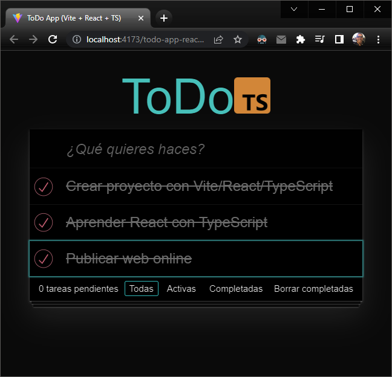

# ToDo App with React and Typescript
---

    

---
## Live Preview:
  -  https://jonatandb.github.io/todo-app-react-typescript/

----

## Project execution:
- npm run dev

---
## Investigated sites
- CSS for TodoMVC apps: https://github.com/tastejs/todomvc-app-css
- Cheatsheets for experienced React developers getting started with TypeScript: https://github.com/typescript-cheatsheets/react
- Deploying a Static Site | Vite: https://vitejs.dev/guide/static-deploy.html
---
## Project initiation:
- Project creation with Vite:
  - npm create vite@latest todo-app-react-typescript

- Adding of linting with Eslint for TypeScript and React:
  - npm init @eslint/config
    - How would you like to use ESLint? -> To check syntax, find problems, and enforce code style
    - What type of modules does your project use? -> JavaScript modules "esm" (import/export)
    - Which framework does your project use? -> React
    - Does your project use TypeScript? -> Yes
    - Where does your code run? -> Browser
    - How would you like to define a style for your project? -> Use a popular style guide -> Standard
    - What format do you want your config file to be in? -> JavaScript
    - Which package manager do you want to use? -> npm
  - Eslint extra setup:
    - .eslintrc.cjs:
      - parserOptions:
        - Adding of: project: './tsconfig.json'
      - rules:
        - Adding of: 'react/react-in-jsx-scope': 'off'
        - Adding of: 'react/prop-types': 'off'
